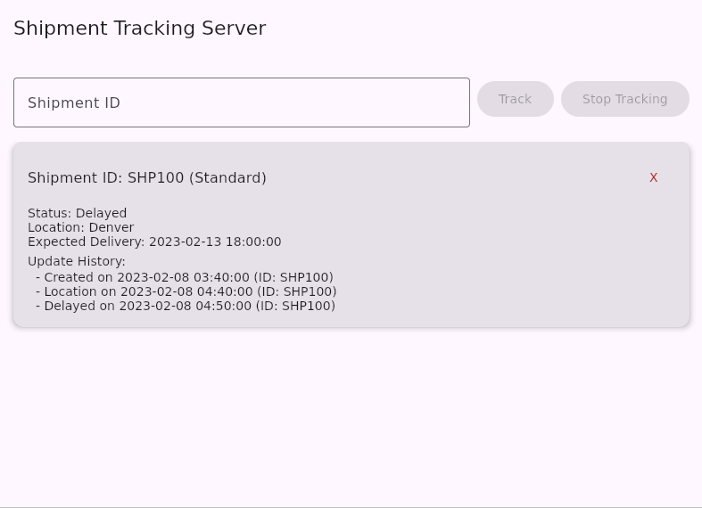

# Shipment Tracking Simulator

**Status**: Fully functional simulation; designed for demonstration and learning.

A Kotlin Compose-based client-server application demonstrating modular shipment lifecycle management.

Uses object-oriented design patterns (Factory, Observer, Strategy, State) to model ship,ent states, handle real-time updates, and provide an extensible architecture.

## Technical Focus

- Object-oriented design with Factory, Observer, Strategy, and State patterns
- Event-driven client-server communication
- Kotlin Compose GUI for real-time simulation
- Modular design for easy extension and experimentation
- Shipment lifecycle modeling and update parsing

## Features

- **Shipment Lifecycle Management**: Models complete shipment journey from creation to delivery
- **Real-time Simulation**: Event-driven updates allow live tracking of shipment states `created`, `shipped`, `delayed`, `lost`, `cancelled`, `location`, `noteAdded`, and `delivered`
- **Client-Server Architecture**: Demonstrates networked communication and UI synchronization using the Observer pattern
- **Compose UI**: Minimal GUI to interact with shipments and view update history

## Constraints & Limitations

- Single-threaded simulation for simplicity and clarity
- Minimal UI to focus on architecture and design patterns
- Local client-server communication only (no external network integration)
- Designed for demonstration and learning, not production deployment

## Quick Start

### Requirements

- JDK 17+
- Gradle (wrapper included)

### Build and run

1. Clone repository:

```bash
git clone https://github.com/SearParsley/shipment-tracking-server.git
cd shipment-tracking-server
```

2. Build and run using Gradle wrapper:

```bash
./gradlew build
./gradlew run
```

*Windows users*: use ` .\gradlew.bat` instead of `./gradlew`.

## Usage

Shipment updates follow this format:

```text
updateType,shipmentId,timestampOfUpdate,otherInfo (optional)
```

- `UpdateType`: {`created`, `delivered`, `delayed`, `lost`, `cancelled`, `location`, `shipped`, `noteAdded`}
- `shipmentId`: unique string
- `timestampOfUpdate`: Unix epoch (ms since 01/01/1970)
- `otherInfo`:
  - `delayed`: timestamp of expected delivery (Unix epoch)
  - `location`: current shipment location
  - `noteAdded`: note text

### Example input

```text
created,SHP100,1675852800000
location,SHP100,1675856400000,Denver
delayed,SHP100,1675857000000,1676336400000
```

### Example Workflow

1. Open both client and server GUI windows
2. In the client window, enter a properly formatted shipment update and click **Send Update to Server**
3. In the server window, enter a shipment ID:
    - Click `Track` to start observing updates
    - Click `Stop Tracking` to stop observing
4. Repeat as needed to simulate shipment progress and view update history

### Example Output



## Architecture

- **State Pattern**: Encapsulates shipment states and transitions
- **Observer Pattern**: Notifies UI of state changes in real-time
- **Strategy Pattern**: Supports different handling approaches for updates
- **Factory Pattern**: Simplifies creation of shipment objects with varied initial states

## Diagrams

### Version 2 UML

Focus: improved modularity, State and Obverser integration


### Version 1 UML

Focus: initial architecture and object relationships


